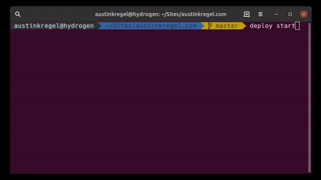

# Deploy.
This package aims to fill a minor void of programmable deployment steps built in NodeJS. Why NodeJS? Because that's one of the only languages I know best, and it's not in a container on my computer.


#### What can this do?
Initially this was meant to be a code deployment tool. Where you set up steps to be ran on your servers, and have it all facilitated from your computer.

But it doesn't have to relate to code deployments. It could be scheduling tasks on servers, or moving around log files, scheduling updates, really the only limit here is what you want to do with a server.

# Installation
```bash
npm i -g @metabit/deploy
```

# Useage
```bash
deploy start
```
or if you're on version > 0.1.0
```bash
deploy step deploy:cleanup
```

# Configuration
When running `deploy start` for the first time we create a `.deploy.js` file by default. In that file we export a variable called `hosts`, and one called `scripts`.
```typescript
type host = {
    name: string;
    ip: string;
    identityFile: string;
    user: string;
}
```
 and 
 ```typescript
type script = {
    name: string;
    file: string;
}
```
Something you may want to keep in mind is that `git` will send things to stderr even when things are successful and the `ssh2` lib can't handle that too well. So I recommend redirecting all output to stdout and just look over the logs.
```
GIT_REPO=git@github.com:austinkregel/finance.git
DEPLOY_NAME=$(date +"%Y%m%d%H%M%S")

git clone "$GIT_REPO" "$DEPLOY_NAME" 2>&1
```

for each script denoted, it will be ran on each server once. Scripts will be ran on servers in order.

Deploy file created on first start:
```js
module.exports = {
    hosts: [
        {
            name: "strontium",
            ip: "198.168.1.20",
            identityFile: "/home/ubuntu/.ssh/id_rsa",
            user: "ubuntu"
        },
    ],
    scripts: [
        {
            name: "updates",
            file: ".scripts/system-updates.sh",
        },
        {
            name: "deploy",
            file: ".scripts/git-clone-composer-install-deploy.sh",
        },
        {
            name: "deploy:prepare",
            file: ".scripts/build-npm.sh",
        },
        {
            name: "deploy:release",
            file: ".scripts/tag-release-deploy.sh",
        }
    ]
}
```

### Scripts
Scripts are located in a `.scripts` directory in your current working directory. Scripts are expected to be bash scripts and are not fed any extra parameters by default.

Scripts cannot be ran in parallel, and is not planned to be a supported feature.

### Hosts
Hosts are expected to be your own. Don't use this tool to do things on other peoples hosts... That's not nice.

Logging into a host with a password will not be supported by this package.

The ip address field for hosts can be either ip addresses or domain names.

Host users can be any valid user with access to a TTY session. 